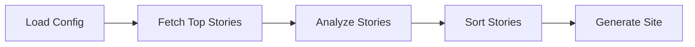

# Hacker News Digest Generator


This project is a Hacker News digest generator that uses AI to analyze and summarize the top stories based on your interests. It's built using [Pocket Flow](https://github.com/The-Pocket/PocketFlow), a 100-line LLM framework.

## Flow

The project follows a simple flow to generate the digest:



1.  **Load Config**: Loads the configuration from `config.yml`.
2.  **Fetch Top Stories**: Fetches the top stories from Hacker News.
3.  **Analyze Stories**: Analyzes the stories and their comments to see if they align with the user's interests.
4.  **Sort Stories**: Sorts the interesting stories by their score.
5.  **Generate Site**: Generates a static HTML site with the digest.

## Installation

It is recommended to use a virtual environment for this project. You can create one using `uv`:

```bash
# Create a virtual environment
uv venv

# Activate the virtual environment
source .venv/bin/activate

# Install the dependencies
uv pip install -r requirements.txt
```

## API Key Management

The application retrieves the OpenAI API key in two ways:

1.  **Password Store (`pass`)**: It first attempts to retrieve the key from the `pass` password manager from the entry `openai/apikey`. This is the recommended approach for security reasons.
2.  **Environment Variable**: If `pass` is not available or the key is not found, it falls back to reading the `OPENAI_API_KEY` environment variable.

You can modify `utils/call_llm.py` to change this behavior.

## How to Run

To generate the Hacker News digest, run:

```bash
python main.py
```

The output will be saved in `index.html`.

## Configuration

The `config.yml` file allows you to configure the digest generation:

-   `top_stories_limit`: The number of top stories to fetch from Hacker News.
-   `comments_limit`: The number of comments to fetch for each story.
-   `areas_of_interest`: A list of topics you are interested in. The AI will use these to filter and rank the stories.