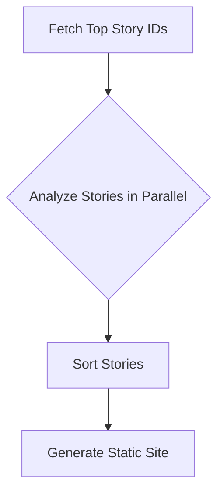

# Design Doc: HN Digest

> Please DON'T remove notes for AI

## Requirements

The system will fetch top stories from Hacker News, analyze them against user-defined interests specified in a YAML file, and generate a minimalistic static HTML website containing only the relevant stories. This saves the user time by filtering out noise.

## Flow Design

> Notes for AI:
> 1. Consider the design patterns of agent, map-reduce, rag, and workflow. Apply them if they fit.
> 2. Present a concise, high-level description of the workflow.

### Applicable Design Pattern:

A **MapReduce**-style pattern will be used.
- **Map:** Each top story ID will be mapped to a process that fetches the story details, its comments, and the content of the linked article. This will be done in parallel.
- **Reduce:** The analyzed stories will be filtered and combined into a single list, which is then used to generate the final static site.

### Flow high-level Design:

1.  **Fetch Top Story IDs**: Get a list of top story IDs from the Hacker News API.
2.  **Analyze Stories (in parallel)**: For each story ID, fetch the story content, comments, and linked URL content. Use an LLM to determine if it matches the user's interests.
3.  **Sort Stories**: Sort the interesting stories by their points in descending order.
4.  **Generate Static Site**: Create a static HTML file with the filtered, interesting stories.



## Utility Functions

> Notes for AI:
> 1. Understand the utility function definition thoroughly by reviewing the doc.
> 2. Include only the necessary utility functions, based on nodes in the flow.

1.  **Config Reader** (`utils/config.py`)
    -   *Input*: `config.yml` path
    -   *Output*: A dictionary with the configuration.
    -   *Necessity*: To load user preferences.

2.  **HackerNews API** (`utils/hackernews.py`)
    -   *Input*: Story ID, number of stories/comments.
    -   *Output*: Story and comment data.
    -   *Necessity*: To get data from Hacker News.

3.  **Web Crawler** (`utils/web.py`)
    -   *Input*: URL
    -   *Output*: Text content of the page.
    -   *Necessity*: To analyze article content.

4.  **Static Site Writer** (`utils/static_site.py`)
    -   *Input*: A list of analyzed stories.
    -   *Output*: An HTML string.
    -   *Necessity*: To generate the final report.

5.  **Call LLM** (`utils/call_llm.py`)
    -   *Input*: prompt (str)
    -   *Output*: response (str)
    -   *Necessity*: To analyze and summarize stories.

## Node Design

### Shared Store

> Notes for AI: Try to minimize data redundancy

The shared store structure is organized as follows:

```python
shared = {
    "config": {}, # Loaded from config.yml
    "top_story_ids": [],
    "interesting_stories": [],
    "html_output": ""
}
```

### Node Steps

> Notes for AI: Carefully decide whether to use Batch/Async Node/Flow.

1.  **LoadConfigNode**
    -   *Purpose*: To load the `config.yml` file into the shared store.
    -   *Type*: Regular
    -   *Steps*:
        -   *exec*: Read the `config.yml` file.
        -   *post*: Store the config dictionary in `shared["config"]`.

2.  **FetchTopStoriesNode**
    -   *Purpose*: To get the top story IDs from Hacker News.
    -   *Type*: Regular
    -   *Steps*:
        -   *prep*: Read `shared["config"]["top_stories_limit"]`.
        -   *exec*: Call the `hackernews.get_top_story_ids` utility.
        -   *post*: Write the list of IDs to `shared["top_story_ids"]`.

3.  **AnalyzeStoriesNode**
    -   *Purpose*: To analyze each story in parallel and filter for interesting ones.
    -   *Type*: `AsyncParallelBatchNode`
    -   *Steps*:
        -   *prep_async*: Return `shared["top_story_ids"]`.
        -   *exec_async*: For each story ID, fetch the story, comments, and URL content. Use the LLM to check if it's interesting. Return the story data if it is, otherwise `None`.
        -   *post_async*: Filter out `None` values and write the list of interesting stories to `shared["interesting_stories"]`.

4.  **GenerateSiteNode**
    -   *Purpose*: To generate the final HTML report.
    -   *Type*: Regular
    -   *Steps*:
        -   *prep*: Read `shared["interesting_stories"]`.
        -   *exec*: Call the `static_site.generate` utility.
        -   *post*: Write the resulting HTML to `shared["html_output"]` and save it to `output/index.html`.